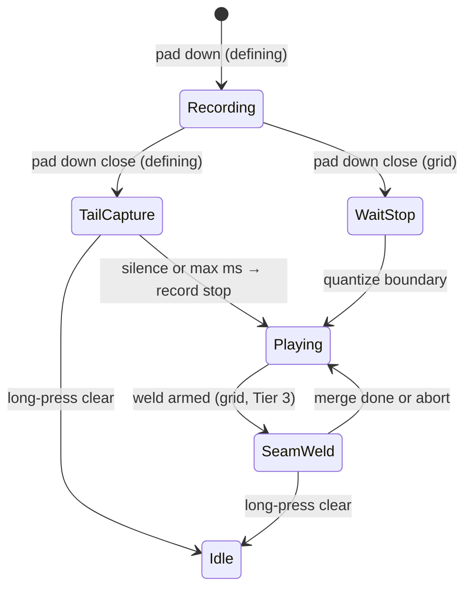

# Looper loop seam — tail capture and wrap continuity

**Issue:** untracked  
**Status:** Approved (P0 + P1); Tier 3 blocked on spike  
**Last updated:** 2026-08-18 (America/Toronto)

**Register:** working hypothesis unless labelled **measured**. Builds on shipped grid
clock work (`looper-transport-clock-spec.md`, `DECISIONS.md` 2026-08-15).

---

## Problem statement

When a take closes (pad-down while recording), the loop often **clicks or drops
content at the wrap** — sample N−1 → sample 0. Mitch reports:

- Wrap pop on repeat (partially addressed by `fade_samples`; still audible on
  some material).
- **Missing release / tail** when stop is immediate — audio still in the JACK
  graph after the OSC stop is not in the buffer.
- Confusion between **pre-roll** (capture before record arm) and **post-roll**
  (capture through release and weld onto the seam). **This spec is post-roll /
  seam only.**

**Product requirement:** closing a take should produce a loop whose **end flows
into its start** on playback, without the player changing technique (pad before
note, EDP threshold tricks, etc.).

**Non-goals:**

- Pre-roll / missing **attack** at loop head (separate concern; may share
  `input_latency` calibration).
- Replacing phase re-anchor (`MPE_SL_GRID_ANCHOR_*`) — orthogonal.
- Overdub as a **performance** mode (Mitch's model is finished clips, not
  EDP-style open-loop layering — `DECISIONS.md` 2026-08-14).

---

## Background — what “seam good” means

At pad-down close:

1. **Playback starts** from sample 0 (SooperLooper already does this on
   record-off → Playing).
2. **Release tail** is still audible (Surge envelope, JACK pipeline).
3. That tail belongs at the **end** of the buffer (near N), not the start — the
   wrap seam is **end → start**.
4. When the envelope is quiet, the tail is **welded** onto `[N−M, N)` and
   crossfaded into `[0, M)` so repeated wraps are continuous.

**Live vs buffer geometry:** hearing “tail blending into the first part” at the
moment of stop is correct **live**; storing tail on sample 0 via overdub-at-playhead-0
fixes the wrong index and can **leak** into the next gesture if the player
switches loops quickly while SL is still in overdub.

---

## Rejected approaches

| Approach | Why rejected |
|----------|----------------|
| Fixed `POST_ROLL_MS` defer before stop | Extends bar by constant ms → wrong BPM on clip 0, fights quantized stop on grid clips. |
| Extend phase re-anchor wrap window | Timing/phase only; does not add audio to the buffer. |
| Naive stop → overdub until silence (all clips, no guard) | Tail lands at playhead 0+; **fast pad switch** leaves another loop/channel in overdub, capturing bleed. |
| `rec_thresh` silence-close in SL alone | SL **ignores threshold on finish** (current docs); not available without bench logic or engine change. |

---

## Design — three tiers (build in order)

### Tier 1 — Latency + crossfade (baseline, all clips)

**Intent:** align SL’s record/stop boundaries with JACK pipeline delay; smooth
wrap regardless of content.

| Control | Action |
|---------|--------|
| `input_latency` | Set per loop (or `-1` all) from JACK reported latency; optional `autoset_latency=1` at engine start. |
| `fade_samples` | Already set via `MPE_SL_FADE_SAMPLES` (default 256); tune after Tier 2/3 if needed. |
| `trigger_latency` | Default 0 unless ear tests say otherwise (forum pattern: drop trigger, tune input only). |

**Where:** `sl_grid_sync.py` → `apply_grid_sync()` and/or
`configure-grid-sync.sh` after engine start.

**Acceptance:** A/B same take with latency unset vs set — wrap pop reduced or
unchanged (not worse). No change to loop length or grid BPM.

---

### Tier 2 — Envelope-following close (clip 0 / defining take only)

**Intent:** free-form first take **may grow** to include natural release; tempo
is derived from final length anyway (`sl_grid_state.py`).

**Behavior on pad-down while recording (defining take only):**

1. Enter **`TAIL_CAPTURE`** bench state — **do not** send `record` stop yet.
2. Continue **Recording** in SL (still `SL_STATE_RECORDING`).
3. Poll `in_peak_meter` (OSC `/sl/{n}/get`) until peak &lt; `MPE_SL_TAIL_THRESH`
   for `MPE_SL_TAIL_HOLD_MS` consecutive, or `MPE_SL_TAIL_MAX_MS` elapses.
4. Send `record` stop → Playing; proceed with existing grid establish +
   phase re-anchor.

**Guardrails:**

- Only when `grid.is_pending(loop)` / defining take (`loop_model.plan_gesture`
  `arm_grid` path).
- **Block** other gestures on **this** loop until capture ends or aborts.
- Bank switch / pad release on **other** loops unaffected.
- Long-press clear still cancels (existing hold path).

**Acceptance (B2 / Mitch ear):** one-bar synth phrase, stop on downbeat —
release audible through wrap; clip 0 `cycle_len` includes tail; derived BPM stable.

---

### Tier 3 — Fixed-bar seam weld (grid clips 1+)

**Intent:** loop length stays **one quantised cycle**; tail after the nominal
stop is captured in parallel and merged at the seam only.

**Behavior on pad-down while recording (grid established, not defining):**

1. If quantised: wait for existing **WAIT_STOP / boundary** behaviour (unchanged).
2. On transition to **Playing** (loop length fixed at N):
   - Enter **`SEAM_WELD`** on this loop only.
   - Start **parallel tail capture** (see spike below).
3. While welding: loop plays; tail buffer fills from loop input (or SL overdub
   scoped to seam — see spike).
4. When envelope quiet or max ms: apply **seam merge** on `[N−M, N)` and
   `[0, M)`; exit weld mode; SL returns to normal Playing.

**Guardrails (required — Mitch concern):**

- **Single-loop lock:** while loop *i* is in `SEAM_WELD` or `TAIL_CAPTURE`, ignore
  record/overdub/mute on *i* except explicit cancel (long-press clear).
- **No overdub leak:** before any command on loop *j≠i*, ensure loop *i* is not
  in SL overdub/recording for tail — force `overdub` off or `undo` tail pass if
  abandoned.
- **Bank switch:** if the welded loop scrolls off-screen, **finish or abort**
  weld within `MPE_SL_TAIL_MAX_MS`; do not leave SL overdubbing on a non-visible
  loop.
- **Abort:** long-press clear or second pad-down cancel → discard tail scratch,
  normal idle.

**Spike (Gate A blocker for Tier 3 implementation):**

SooperLooper has **no** “weld tail here” OSC. Candidates to prove on bench:

| Option | Pros | Cons |
|--------|------|------|
| **A. Stay in Record until silence** after quantize boundary | SL-native | **Extends** N past bar — breaks fixed-bar unless stop aligns perfectly. |
| **B. Scratch loop slot** — record tail on loop 15, substitute/copy | SL-native-ish | Needs command sequence; 16-loop limit; complex UX. |
| **C. JACK-side tail tap** (`mpe-looper` or tap port) + offline merge | Full control | New audio path; CPU; not Phase 1. |
| **D. SL substitute** at end of first playback cycle | One cycle replace | Playhead timing; tail may be gone before playhead reaches N. |

**Decision rule:** Tier 3 code starts only after spike documents **one** viable
path with ear pass on 1-bar grid clip. Until then, ship Tier 1 + Tier 2.

---

## State machine (bench layer)

New states in `apc_footswitch.py` (per loop, orthogonal to `sl_state`):

```
IDLE / RECORDING / PLAYING / …  (existing derive_state)

TAIL_CAPTURE   — Tier 2; SL still Recording; waiting for silence
SEAM_WELD      — Tier 3; SL Playing; tail scratch + merge pending
```



LED hint (hypothesis): blink **amber** during `TAIL_CAPTURE` / `SEAM_WELD` so
“still finishing take” is visible and fast switching is discouraged.

---

## Configuration (env)

| Variable | Default | Meaning |
|----------|---------|---------|
| `MPE_SL_TAIL_THRESH` | `0.02` | Peak meter below this = silence ( tune on Pi ) |
| `MPE_SL_TAIL_HOLD_MS` | `80` | Consecutive silence before close |
| `MPE_SL_TAIL_MAX_MS` | `750` | Force close / abort weld |
| `MPE_SL_SEAM_MERGE_SAMPLES` | `2048` | Crossfade width M at seam (Tier 3) |
| `MPE_SL_TAIL_CAPTURE` | `1` | Master enable Tier 2; `0` = Tier 1 only |
| `MPE_SL_SEAM_WELD` | `0` | Tier 3 off until spike passes |
| `MPE_SL_INPUT_LATENCY` | *(unset)* | Override; else JACK autoset |
| `MPE_SL_FADE_SAMPLES` | `256` | Existing global crossfade |

---

## Acceptance criteria

| ID | Tier | Criterion | Test type |
|----|------|-----------|-----------|
| S1 | 1 | `input_latency` / `fade_samples` applied on every `sl-grid-sync` / engine restart | Unit + `dump-loop-levels` |
| S2 | 1 | Wrap pop not worse than baseline on clip 0 (Mitch ear) | Manual B2 |
| S3 | 2 | Defining take includes release; no infinite record on stuck note (max ms) | Unit poll logic + ear |
| S4 | 2 | Long-press clear during tail capture → idle, no orphan SL Recording | Manual |
| S5 | 3 | Grid clip length = exactly one cycle after weld; tail at seam not at sample 0 only | Ear + `cycle_len` OSC |
| S6 | * | Fast switch to another pad during weld → **no** overdub bleed on other loop | Manual (Mitch scenario) |
| S7 | * | Grid BPM unchanged by tail capture on clips 1+ | `derive_tempo` unchanged |

---

## Implementation plan

| Phase | Deliverable | Gate |
|-------|-------------|------|
| **P0** | Tier 1: wire latency + document tuning procedure | Mitch ear S2 |
| **P1** | Tier 2: `TAIL_CAPTURE` in `apc_footswitch.py`, peak poll, tests | Spec review + S3–S4 |
| **P2** | Tier 3 spike write-up in `docs/measurements/` | Pick option A–D |
| **P3** | Tier 3 implementation (if spike passes) | S5–S7 |

**Files (expected touch):**

- `scripts/sooperlooper/sl_grid_sync.py` — Tier 1
- `scripts/sooperlooper/apc_footswitch.py` — state machine, peak poll
- `scripts/sooperlooper/loop_model.py` — gesture plans for tail vs immediate stop
- `tests/test_apc_footswitch.py` — tail timeout, thresh hold, abort
- `config/mpe.env.example` — new vars
- `Documents/DECISIONS.md` — row on seam policy when promoted

---

## Falsification

| If | Then |
|----|------|
| Tier 1 alone fixes wrap on clip 0 + grid clips | Stop at P0; defer P1–P3 |
| Tier 2 makes clip 0 length unstable / weird BPM | Lower max ms or disable Tier 2; rely on Tier 1 |
| No Tier 3 spike passes | Document “grid clips: quantize stop + Tier 1 only”; close Tier 3 |
| Peak meter too noisy on Pi | RMS from JACK tap or higher thresh; do not ship hot-loop overdub |

---

## References

- SooperLooper sync/latency: https://sonosaurus.com/sooperlooper/doc_sync.html  
- OSC `in_peak_meter`, `input_latency`: https://sonosaurus.com/sooperlooper/doc_osc.html  
- Grid / phase: `Documents/specs/looper-transport-clock-spec.md` §K  
- Pad gesture plan: `scripts/sooperlooper/loop_model.py`  
- Wrap pop history: `looper-transport-clock-spec.md` §B  

---

## Open questions (for spec review)

1. **Tier 2 on grid defining take only** — confirm clip 0 always free-form even
   if grid was dropped and re-armed on same pad.
2. **LED colour** during tail capture — amber vs faster blink green?
3. **Tier 3 spike owner** — bench session vs nerdrack YOLO after Gate A.

**Next step:** `spec-review` → Gate A → P0 implementation.
