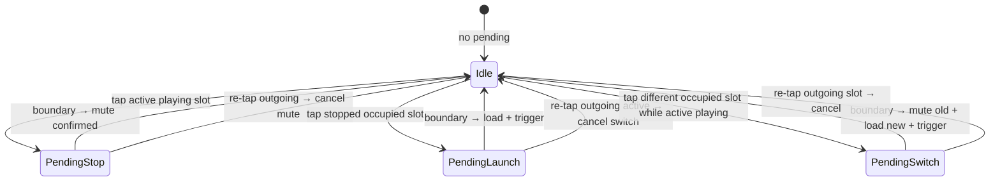

# Multi-clip per track — Ableton-style slot matrix

**Issue:** untracked (Gate A)  
**Status:** Draft (Gate A — Mitch approval required)  
**Last updated:** 2026-08-26 (America/Toronto)

**Register:** working hypothesis unless labelled **measured**. Builds on shipped
grid clock (`looper-transport-clock-spec.md`), seam weld (`looper-loop-seam-spec.md`),
and song save/load v1 (`looper_songs.py` / touch HUD).

**Locked product decisions (Mitch 2026-08-26):** see §TL;DR and body — do not
re-litigate without a dated DECISIONS row.

---

## TL;DR

Move from **one clip per SooperLooper loop** (today: 16 loops = 16 pads on row 0
only) to **Ableton Session View semantics**:

| Axis | Meaning |
|------|---------|
| **Column** | One **track** (16 total; APC shows 8, banked) |
| **Row 0–7** | **Clip slot** on that track (8 slots per column) |
| **Audible rule** | At most **one slot playing per column** — not polyphonic stacking |
| **Switch** | Quantized: **mute/stop outgoing + launch incoming** on the same bar |
| **Cancel** | Re-tap the **outgoing** slot before the boundary → abort pending switch |
| **Scene Launch 1–8** | Toggle **slot row** across **all 16 tracks** (not visible-8 only) |
| **Persistence** | Manifest **v2** — full 16×8 slot matrix; **manual save only** |
| **Touch** | Save/Load whole session via existing HUD — **in scope**; per-slot matrix UI — **not** |

**Prerequisite (Phase 0):** pending-mute **cancel** on the **current single-slot**
model must ship first — same gesture muscle memory the multi-clip switch reuses.

**Out of scope v1:** autosave (file GitHub issue), touch matrix editor, scene/row
clear gesture (Stop All + hold-clear per pad unchanged).

---

## Problem statement

Today's bench maps **one SooperLooper loop ↔ one APC pad** on clip row 0 only
(`apc_grid.py`: `CLIP_ROW = 0`, rows 1–7 reserved). That matches 16 independent
loops, not **multiple finished takes per track** with quantized switching.

Mitch's play style (DECISIONS.md 2026-08-14 "Loop UX") is Session View: several
recorded clips per track, one audible at a time, row launches across the set.
Song save v1 already persists loop WAVs + manifest, but only the **flat 16-loop**
layout — one file per loop index, no slot dimension.

**Product requirement:** 8 clip slots × 16 tracks; switch clips on a column
without polyphony; scene rows launch/stop a horizontal slice; save/load restores
the full matrix from touch (and later APC/bench).

---

## Non-goals

| Item | Notes |
|------|-------|
| Polyphonic clips per column | Two slots on the same track never play together |
| Touch UI for editing the 8×16 matrix | Save/load whole session is enough for v1 |
| Autosave on stop/switch/power | Manual save only; track as future GitHub issue |
| Scene row clear / "exclusive row off" gesture | Only Stop All + per-pad hold-clear (`undo_all`) |
| Replacing seam weld or grid clock | Orthogonal; slot switch uses same quantize path |
| Second SooperLooper instance / >16 engine loops | 16 SL loops = 16 **tracks**; slots are bench-managed storage |
| Full APC shift-layer multiply/reverse in this spec | Separate work; shares persistence layer when ready |

---

## Grid model

### APC 8×8 layout (after this spec)

```
        col0   col1   …   col7     ← 8 visible tracks (viewport offset)
row 7   slot7  slot7  …  slot7    Scene Launch 8 ↔ row 7
  …
row 1   slot1  slot1  …  slot1    Scene Launch 2 ↔ row 1
row 0   slot0  slot0  …  slot0    Scene Launch 1 ↔ row 0  (bottom row)
        track  track  …  track
        +off   +off+1      +off+7
```

- **Columns = tracks** `T ∈ [0, 15]`. Viewport `offset` banks which 8 tracks appear
  (same travel model as `GridView` today — `PAGE_STEP = 8`, `NUDGE_STEP = 1` with Shift).
- **Rows = slot index** `S ∈ [0, 7]`. Row 0 is the APC bottom row (`pad_note` convention).
- **Pad `(S, col)`** addresses `(track = offset + col, slot = S)`.
- **All 8 rows** are clip slots — no separate "controller rows" in v1.

### Engine mapping

| Concept | SooperLooper | Bench layer |
|---------|--------------|-------------|
| Track `T` | Loop index `T` (0–15) | Column `T`; one **active slot** pointer per track |
| Slot `S` | Not a native SL object | WAV + metadata in manifest; loaded into loop `T` on launch |
| Scratch / weld | Loop 15 (unchanged) | Never a track; excluded from songs |
| Audible on track | Loop `T` playing or muted | Exactly one slot's audio loaded in loop `T` when occupied |

**Implication:** up to **128 occupied slot WAVs** in storage, but still **≤16 loops
playing** across tracks (one per column max). Recorded-but-idle slots add memory like
today's idle loops (see DIRECTION.md memory table).

---

## Pad semantics (per cell)

Gestures apply to **(track, slot)**. Existing record/stop/clear vocabulary from
`loop_model.py` extends with **slot selection** and **pending switch**.

### Tap matrix (grid established, quantized)

| Cell state | Pad down | Pad up | Result |
|------------|----------|--------|--------|
| **Empty** | Arm record into this slot | — | Record starts (free-form if no grid; else quantize arm per existing rules) |
| **Recording (this slot)** | Close take (quantize stop if grid clip) | — | Slot occupied; may become active if first on track |
| **Playing (this slot, active)** | Queue **mute** at boundary (stop) | — | Pending stop; LED blink |
| **Playing (this slot, active)** + pending stop | **Cancel** — `mute_off` or equivalent abort | — | Stay playing; clear pending |
| **Stopped (occupied, not active)** | Select + queue **launch** at boundary | — | Pending switch: mute active slot on track, load this slot, trigger |
| **Stopped (occupied)** while **other slot active** on same track | Queue **switch** at boundary | — | Outgoing = active slot; incoming = this slot |
| **Stopped (occupied)** while **this slot is active** (muted) | Queue **launch** | — | Relaunch same slot on bar |
| **Any occupied** | Hold ≥ clear threshold | — | `undo_all` on track loop + remove slot from matrix (unchanged clear gesture) |

**Not polyphonic:** launching slot B on a track with slot A playing never layers A+B.
The bench always schedules **mute/stop A** and **load+trigger B** for the same
quantize boundary.

**Defining take / seam weld:** first take that establishes grid tempo may still use
seam weld on the **track's active slot** — same as today on that loop index; slot
index recorded in matrix metadata.

### LED hints (contract)

| Meaning | LED |
|---------|-----|
| Empty | Off |
| Occupied, stopped | Yellow (or slot-dim — match existing stopped) |
| Playing (confirmed) | Green solid |
| Recording | Red / red blink (WAIT_START) |
| Pending launch or pending stop/switch | Green or yellow **blink** on affected pad(s) |
| Outgoing slot with pending switch | Blink until boundary or cancel |
| Seam weld active on track | Amber on active slot (existing seam spec) |

Solid = engine confirmed; blink = bench `pending` (same contract as `loop_model.py`).

---

## Scene Launch rows (1–8)

Scene Launch button `R` (1-based) ↔ **slot row** `S = R − 1`.

**Scope:** affects **all 16 tracks**, including tracks banked off the visible 8.
Implementation must iterate `T ∈ [0, 15]`, not `visible_loops()` only.

### Row state

**Occupied slot** = slot has audio (`loop_len > MIN` or manifest entry present).

| Scene row LED | Condition |
|---------------|-----------|
| **OFF** (dark) | For row `S`: every **occupied** slot `(T, S)` across all tracks is **playing** (active on its track). Empty columns **do not count** — if track T has no slot S, skip T. |
| **ON** (lit) | At least one occupied `(T, S)` is **not** playing (stopped or another slot active on T) |

### Toggle on press

| Row LED before | Action |
|----------------|--------|
| **ON** | **Launch row:** for each track `T` where slot `(T, S)` is **occupied** and **not currently playing**, queue the same **switch** as a pad launch (mute active on T if any, load `(T,S)`, trigger at boundary). Tracks with empty slot S: no-op. |
| **OFF** | **Stop row:** for each track `T` where slot `(T, S)` is **occupied** and **playing** (active), queue **mute** at boundary. Do not stop other slots on T. |

No separate "scene clear" — stopping the row mutes playing cells in that row only.

**Stop All Clips** (Scene Launch 8 on mk1 / dedicated button): unchanged — immediate
mute all tracks (`stop_all_loops`), lift/restore `mute_quantized`.

---

## Cancel and transition state machine

Per **track** `T`, bench holds:

```
active_slot: S | None          # which slot is loaded / considered "live" on loop T
pending: None | STOP | LAUNCH(slot) | SWITCH(from, to)
```

Global quantize fires on bar boundary (existing `mute_quantized` + SL sync).



**Cancel rule (locked):** re-tap the **outgoing** slot before the boundary:

- **Pending stop** on active slot → send cancel (`mute_off` if SL still playing unmuted,
  or clear pending without sending mute — spike § below).
- **Pending switch** → clear pending; outgoing keeps playing; incoming stays stopped.

**Phase 0 prerequisite:** implement cancel on **today's** single-slot-per-track model
(one slot per loop, row 0 only) so WAIT_STOP / pending-mute cancel is proven before
the slot matrix multiplies surface area.

**Interaction with seam weld:** while track `T` is in `SEAM_WELD`, ignore launch/switch
on that track except hold-clear abort (per seam spec single-loop lock).

---

## Persistence — manifest v2 (sketch)

Manual save only. v1 songs remain loadable (reader accepts `version: 1`).

### File layout

```
~/.mpe/looper-songs/
  {slug}.json
  {slug}_t{TT}_s{S}.wav    # TT = track 00–15, S = slot 0–7
```

v1 `{slug}_{loop:02d}.wav` may be migrated on read or left as legacy; v2 writer uses
track/slot names only.

### Manifest v2 (example)

```json
{
  "version": 2,
  "name": "Evening jam",
  "slug": "evening-jam",
  "saved_at": "2026-08-26T11:00:00-04:00",
  "bpm": 120.0,
  "grid_active": true,
  "tracks": [
    {
      "track": 0,
      "wet": 1.0,
      "active_slot": 2,
      "slots": [
        null,
        null,
        {
          "file": "evening-jam_t00_s2.wav",
          "len_s": 4.0,
          "sl_state": 2
        }
      ]
    }
  ]
}
```

| Field | Meaning |
|-------|---------|
| `tracks[].track` | Loop index 0–15 |
| `tracks[].active_slot` | Which slot was loaded at save time (`null` if track empty) |
| `tracks[].slots` | Length-8 array; `null` = empty slot |
| `slots[].sl_state` | SL state enum at save (playing → reload triggers; muted → mute_on) |
| `bpm` / `grid_active` | Same as v1 |

**Save path (`looper_songs.py`):**

1. `stop_playback` (all tracks muted/paused, quantize lifted briefly).
2. For each occupied `(T, S)`: `save_loop` from loop `T` **only if** `(T,S)` is the
   loaded active slot; other occupied slots already on disk from prior saves or
   must be copied from slot buffer — **spike:** whether every occupied slot stays
   resident in SL or is swapped from disk only on launch.
3. Write atomic manifest v2.

**Load path:**

1. `stop_playback` + `clear_all_loops`.
2. `apply_grid_sync` + establish grid if `grid_active`.
3. For each occupied slot: `load_loop` into track `T` when applying active slot;
   inactive slots: store WAV paths only, load on first launch (lazy) or preload all
   — **spike** (memory vs latency).

**Touch HUD (`touch_browser_looper_songs.py`):** no UI change to menu flow; must
save/load v2 without error when matrix has multiple slots per track. Confirm
overwrite / load-replace dialogs still correct.

---

## Touch HUD acceptance (save/load v2)

| ID | Criterion | Test |
|----|-----------|------|
| T1 | Save with 0 slots occupied → same error as v1 ("Nothing to save") | Unit |
| T2 | Save with ≥2 slots on same track → manifest v2 + ≥2 WAVs for that track | Unit + disk |
| T3 | Load v2 restores BPM/grid and active slots audibly | Manual ear |
| T4 | Load v2 with inactive slots → launch from APC/touch path works without re-save | Manual |
| T5 | v1 song still loads (backward compat) | Unit |
| T6 | Busy/confirm/toast UX unchanged; no matrix editor added | Visual |

---

## Relationship to current code

| Today | After |
|-------|-------|
| `apc_grid.CLIP_ROW = 0` only | All rows 0–7 address slots |
| `loop_for_pad(row, col)` ignores row ≠ 0 | `slot_for_pad(row, col)` + `track_for_pad` |
| `looper_songs` MANIFEST_VERSION = 1, one WAV per loop index | v2 track/slot matrix |
| Scene Launch buttons unused for clips | Rows 1–8 toggle slot rows 0–7 |
| One clip per loop index | Slot matrix + active pointer per track |

Multi-clip **APC/bench gesture** work is a **separate implementation track** from
Phase 0 cancel, but **shares** `looper_songs.py` v2 persistence with touch save/load.

---

## Files (expected touch)

| File | Change |
|------|--------|
| `scripts/sooperlooper/apc_grid.py` | All rows = slots; `(track, slot)` addressing |
| `scripts/sooperlooper/loop_model.py` | Slot-aware plans; pending switch/cancel |
| `scripts/sooperlooper/apc_footswitch.py` | Per-(track,slot) state; scene row handler |
| `scripts/sooperlooper/apc_transport.py` | Scene Launch 1–7 → row toggle (8 = Stop All unchanged) |
| `scripts/sooperlooper/looper_songs.py` | Manifest v2 read/write; v1 compat |
| `scripts/sooperlooper/slot_matrix.py` | **New** — active slot, occupancy, pending (pure) |
| `patch_browser/touch_browser_looper_songs.py` | v2 save/load integration tests hook |
| `tests/test_loop_model.py` | Cancel + switch plans |
| `tests/test_slot_matrix.py` | **New** — scene row logic, occupancy |
| `tests/test_looper_songs.py` | v2 round-trip |
| `config/mpe.env.example` | Any matrix limits |
| `Documents/DECISIONS.md` | Row on Gate A approval |

---

## Phases

| Phase | Deliverable | Gate |
|-------|-------------|------|
| **P0** | Pending-mute **cancel** on single-slot (row 0) model | Unit + Mitch tap test |
| **P1** | `slot_matrix` pure layer + manifest v2 save/load (touch HUD) | T1–T6 |
| **P2** | APC grid all rows; pad switch/stop/record per §semantics | Mitch ear + unit |
| **P3** | Scene Launch 1–7 row toggle across 16 tracks | Scene LED + launch/stop |
| **P4** | Spike outcomes wired (load timing, inactive slot residency) | Measurement note |

P0 is **blocking** for P2/P3. P1 can parallel P0 if v2 writer reads active slot only
first, then fills multi-slot once swap logic exists.

---

## Risks

| Risk | Mitigation |
|------|------------|
| 128 WAVs × load time on full load | Lazy load inactive slots; spike save_loop/load_loop timing |
| Memory with many occupied idle slots | Same as 64 idle loops — monitor VmRSS; `-t` tuning |
| Cancel via `mute_off` vs SL WAIT states | Spike on engine; mirror WAIT_STOP cancel (`record` cancel pattern) |
| Scene row + pending switch race | Single pending per track; scene applies after cancel clears |
| v1 song migration | Keep v1 reader; optional one-time upgrade tool later |
| Seam weld during switch | Block switch on track in SEAM_WELD |

---

## Spike (Gate A — before P1/P2 implementation)

Run on bench (Pi or laptop + SL):

| # | Question | Method | Pass |
|---|----------|--------|------|
| SP1 | `save_loop` / `load_loop` timing for 16 tracks × up to 8 slots | Script: measure per-call latency, full matrix save | Document p95; touch UI timeout budget |
| SP2 | Inactive slot storage: disk-only vs keep in SL loop slots | Try load-on-launch vs preload all | Pick one; record memory |
| SP3 | **mute_off cancel** for pending quantized mute | Tap play → tap stop → re-tap before bar | Outgoing keeps playing; no glitch |
| SP4 | Switch: mute track A slot + load B + trigger same boundary | OSC sequence from bench | One audible clip after boundary |
| SP5 | Scene row launch with 16 tracks (8 off-screen) | Iterate all loop indices | All occupied cells in row queue |

Spike write-up: `docs/measurements/multi-clip-slot-spike-YYYY-MM-DD.md`.

---

## Open items (Gate A approval)

1. **Inactive slot residency** — disk-only lazy load vs preload all occupied slots at song load (SP2).
2. **Empty track row in scene** — confirm: empty `(T,S)` skips silently (locked, restate for LED).
3. **v1 migration** — auto-upgrade on save vs read-only v1 forever.
4. **Record into non-active slot** — load empty loop on track first, or dedicated record buffer?
5. **LED colour for "occupied stopped" vs "empty"** — yellow vs off on APC.
6. **GitHub issue title** for autosave (out of scope) — create on Gate A approval?
7. **Phase 0 owner** — laptop session vs nerdrack queue after spec approved.

**Next step:** `spec-review` → Mitch Gate A → P0 implementation.

---

## References

- Grid viewport: `scripts/sooperlooper/apc_grid.py`
- Gesture plans: `scripts/sooperlooper/loop_model.py`
- Songs v1: `scripts/sooperlooper/looper_songs.py`
- Touch HUD: `patch_browser/touch_browser_looper_songs.py`
- Seam / quantize: `Documents/specs/looper-loop-seam-spec.md`, `looper-transport-clock-spec.md`
- UX canon: `Documents/DECISIONS.md` 2026-08-14 "Loop UX"
