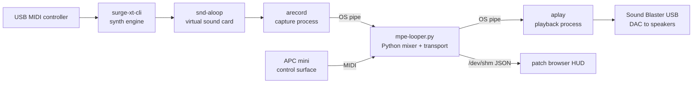

# Audio engine foundation — how it works, what's actually broken, what to build

*Last updated: 2026-08-11 23:45 (America/Toronto)*

**Status:** Part A (mixer fix) and Part B2/B3 (realtime opt-in, HUD health) are
done and measured — see the appendix. B1 (CPU governor) is open, and the board
turned out to be under-voltage, which matters more (§Appendix).

**Purpose:** this is a teaching document, not a task list. It explains the audio
fundamentals underneath the looper so you can weigh in on the architecture
decisions yourself rather than take my word for them. Every claim that is
measured is labelled measured; every claim that is inference is labelled
inference.

Read Parts 1–4 to understand the problem. Part 5 maps what we have. Parts 6–8
are the decisions.

---

## Part 1 — The physical layer and its vocabulary

### Samples, frames, sample rate

Digital audio is a list of numbers. Each number is a **sample**: a measurement
of speaker-cone position at one instant. We use signed 16-bit integers, so each
sample is a whole number from **-32768 to +32767**. Zero is silence; the
extremes are the loudest the format can represent.

Stereo means two samples per instant (left, right). One left-plus-right pair is
a **frame**. At 16-bit stereo, one frame is 4 bytes.

**Sample rate** is how many frames per second. We run 48000. So one second of
audio is 48000 frames = 192000 bytes, and one frame represents 1/48000 s ≈
20.8 microseconds of time.

That's the whole format. Everything else is bookkeeping around moving these
numbers on time.

### Periods, buffers, and the deadline

The sound card does not want one frame at a time — that would mean 48000
handoffs per second. Instead the driver hands over a **period** (also called a
block or a chunk) at a time. We use **512 frames**.

512 frames at 48000 frames/sec = **10.67 milliseconds** of audio per period.

This number is the single most important constant in the system, because it is
simultaneously:

- **The latency floor.** Audio entering the pipeline waits up to a period before
  it can leave. Each stage that buffers adds another period. Four stages of 512
  is roughly 42 ms of built-in delay before anything you did to the code
  matters.
- **The deadline.** The DAC consumes 512 frames every 10.67 ms whether or not we
  have produced them. If our code takes longer than 10.67 ms to produce a
  period, we are permanently behind — and being behind is not recoverable by
  working faster later, because the next deadline has already started.

This is the thing that makes audio different from ordinary software. In a web
request, slow means the user waits. In audio, slow means **the output is
destroyed**, because the hardware does not wait.

### Underruns (xruns) — what crackle physically is

When the DAC's buffer runs dry because we didn't deliver in time, the driver has
nothing to send to the speaker. It sends whatever is in memory — usually zeros
or the stale previous period. The speaker cone slams to a new position
discontinuously.

A discontinuity in a waveform is broadband noise. Your ear hears it as a click,
a tick, or — when it happens dozens of times a second — as continuous crackle.

That event is called an **underrun** on playback, an **overrun** on capture, and
collectively an **xrun**. Crackle is not "a bit of distortion." It is a literal
count of missed deadlines, and it is exactly measurable — which is what we
built tonight.

### What "realtime" means (it does not mean fast)

Realtime means **bounded worst case**, not high throughput. A system that
produces a period in 1 ms on average but occasionally takes 40 ms is *worse*
than one that always takes 9 ms, even though the first one is four times faster
on average. Audio is judged entirely on the worst case, because the worst case
is the one you hear.

Three things break bounded worst case on a general-purpose OS:

1. **Scheduling.** By default Linux may not run our thread for tens of
   milliseconds if something else wants the CPU. The fix is realtime scheduling
   policy (`SCHED_FIFO`) with an elevated priority, which tells the kernel this
   thread pre-empts normal work.
2. **CPU frequency scaling.** The `ondemand` governor lowers clock speed when
   it thinks the machine is idle, then takes milliseconds to ramp back up. An
   audio thread that sleeps between periods looks idle. (Measured: the Pi is on
   `ondemand`.)
3. **Anything unbounded inside the deadline** — memory allocation, garbage
   collection, file I/O, lock contention, a network call. Professional audio
   code forbids all of these inside the audio callback, on principle.

Python's garbage collector and global interpreter lock (GIL) both fall in
category 3. This matters later.

---

## Part 2 — Gain, clipping, and a real bug in our code

### Gain is multiplication

To make something quieter you multiply every sample by a number below 1.0. Gain
0.5 halves the amplitude (about -6 dB). Gain 1.0 is unchanged.

To mix two sources you **add** their samples. Addition is the entire mixing
operation — a mixer is a summing junction, that's all it is.

### Why summing needs headroom

Two signals at full scale sum to twice full scale, which doesn't fit in 16 bits.
Whatever exceeds ±32767 must go somewhere. Two options:

- **Clip** — pin it at the maximum. The waveform's peaks get flattened into
  straight lines. Flattened peaks are harmonic distortion; it sounds like fuzz
  or grit, and on a sustained pad it sounds like the sound is tearing.
- **Scale down first** — give each source less gain so the sum fits.

Our engine does the second: `mix_live_and_loops` divides the loop bus gain by
the number of playing layers, so N layers each get `loop_gain / N`. Three loops
each play at 1/3 gain, so together they peak around the bus ceiling instead of
3x over it. That design is correct.

### The bug: a float multiplier passed as fixed-point

`audioop.mul(fragment, width, factor)` takes **factor as a floating-point
multiplier**. Gain 0.5 means you pass `0.5`.

Our code passes a fixed-point integer instead:

```python
factor = max(0, min(_GAIN_SCALE, int(round(gain * _GAIN_SCALE))))  # _GAIN_SCALE = 32768
return audioop.mul(pcm, _AUDIOOP_WIDTH, factor)
```

So a requested gain of 0.5 was sent to `audioop` as **16384** — it multiplied
every sample by sixteen thousand, and everything saturated to full scale.
Requested gain 1.0 would multiply by 32768.

This was the real reason the fast path had been disabled. The comment guarding
it read:

```python
# Fast audioop path only on CPython 3.12 stdlib; 3.13+ backport (CI) clips before headroom.
if audioop is not None and _AUDIOOP_BACKEND == "stdlib":
```

The observed symptom — "it clips" — was real. The diagnosis — "the 3.13 backport
behaves differently" — was wrong. The clipping was ours: we handed the library a
multiplier three to four orders of magnitude too large, which clips identically
on stdlib `audioop`; it just happened to be noticed on the backport.

**Now measured, 2026-08-11.** A test that applies gain 0.5 to a half-scale
signal returned **32767 where 8000 was expected**. Written to fail first, run on
the Pi, then made to pass by passing the float gain. See
`tests/test_looper_engine.py`.

The consequence was large: because the C path was fenced off behind
`_AUDIOOP_BACKEND == "stdlib"`, and the Pi reports `lts`, **the Pi had been
running the pure-Python fallback all along** — which was the crackle. Both
faults were one edit: pass the float, drop the fence.

---

## Part 3 — The library question: what happened to `audioop`, and what replaces it

### What `audioop` is

`audioop` was a small C module in the Python standard library, present since the
early 1990s, for exactly this kind of work on raw PCM byte strings: multiply,
add, find the peak, convert widths, resample. Its value is that a call like
`audioop.add(a, b, 2)` processes an entire buffer inside compiled C — one
Python-level call, then a tight machine-code loop.

### Why it's gone

**PEP 594, "Removing dead batteries."** Python removed a batch of legacy stdlib
modules in **3.13** — `audioop`, `aifc`, `sunau`, `chunk`, `cgi`, `telnetlib`
and others. The rationale was maintenance burden: modules nobody owned, thinly
tested, some with a history of memory-safety bugs, most tied to formats from the
Sun/SGI era. `audioop` was not removed because it was wrong; it was removed
because nobody in core wanted to keep maintaining C code for it.

### What replaces it

There is no single successor. The ecosystem split three ways:

| Replacement | What it is | When it's right |
|---|---|---|
| **`audioop-lts`** | The exact same C code, extracted into a PyPI package by the community specifically for the 3.13 transition. Imports as `audioop`. | Drop-in continuity. It is what we already install. |
| **NumPy** | General numeric arrays. `np.frombuffer(pcm, '<i2')` views the buffer as integers with zero copying; then add, multiply and clip run as vectorized C over the whole array. | The mainstream answer. More capable than `audioop` (float mixing, fades, metering, resampling) and actively maintained. |
| **Compiled DSP** — a C/Rust extension, or a library like `sounddevice`/`PortAudio` with your own kernel | Full control, no interpreter in the inner loop. | When you need guaranteed worst-case timing, not just good average speed. |

`audioop-lts` is a bridge, not a foundation. It is one volunteer maintainer away
from the same problem, and it can only do the fixed set of operations someone
wrote in 1993. **NumPy is the honest long-term answer for a Python mixer.**

### Why the pure-Python loop is catastrophic, specifically

Here is the fallback that was running on the Pi (still present, now only used
when no `audioop` backend is installed at all):

```python
    for frame_idx in range(frame_count):
        base = frame_idx * S16_STEREO_FRAME_BYTES
        left = 0.0
        right = 0.0
        for stream, gain in zip(streams, gains_list, strict=True):
            l_val, r_val = struct.unpack_from("<hh", stream, base)
            left += l_val * gain
            right += r_val * gain
        struct.pack_into(
            "<hh",
            out,
            base,
            int(max(-S16_CLIP - 1, min(S16_CLIP, round(left)))),
            int(max(-S16_CLIP - 1, min(S16_CLIP, round(right)))),
        )
```

Per period of 512 frames with 3 loops plus live input, that is 512 iterations x
4 streams = **2048 `struct.unpack_from` calls, plus 512 `pack_into` calls, plus
several thousand float operations and boxed integer allocations** — all in
interpreted bytecode, all inside a 10.67 ms deadline.

The equivalent NumPy expression is roughly:

```python
acc = np.zeros(frames * 2, dtype=np.int32)
for chunk, gain in zip(streams, gains):
    acc += (np.frombuffer(chunk, "<i2") * gain).astype(np.int32)
np.clip(acc, -32768, 32767, out=acc).astype("<i2").tobytes()
```

Same arithmetic — but **four Python-level calls instead of thousands**, with the
per-element work in compiled, SIMD-capable C. This is the entire reason for the
performance gap. It is not that Python is "slow at math"; it is that the
interpreter overhead per element (~50–100x the arithmetic itself) is paid 10000
times per period instead of 4 times.

### What we measured tonight

- The mixer took **13–14.5 ms** per period against a **10.67 ms** budget.
- **418 of 421** periods in the sample window blew the deadline.
- `aplay` reported **53 underruns in 5 seconds**, roughly **480 ms of dropout**.
- We produced **421 periods where 469 were needed** — about **90% of realtime**,
  i.e. a persistent ~10% starvation of the DAC. That is your crackle, and it is
  also why it grows with layer count: cost scales linearly with streams.

---

## Part 4 — Why the CPU meter lied

You saw low CPU and crackle at the same time, and correctly found that
suspicious.

**Correction to an earlier draft of this document.** I described the header
meter as an aggregate system CPU reading. Reading
`patch_browser/surge_cpu_monitor.py`, it is not: it samples `/proc` CPU time for
the **`surge-xt-cli` process only**, scaled so one core at 100% reads 100. As a
synth-load meter that is reasonable, and it is worth keeping. The problem is
narrower than "the meter is wrong":

**1. It watches the wrong process.** The meter never looked at the looper. The
mixer could miss every deadline while the meter showed Surge idling, because
Surge genuinely was idling — it is the looper that was late.

**2. CPU% is the wrong unit for a deadline.** The number that matters is
**deadline utilization**: time spent producing a period divided by the period
duration. 14.5 / 10.67 = **136%**. Above 100% you drop audio, and idle time on
the other three cores does not help, because the work is serial and pinned to
one thread.

**3. Mean hides the failure.** A stage averaging 30% of budget but spiking to
200% once a second is audibly broken. Worst case is what you hear.

So the HUD needs, for the looper: worst-case period cost as a percentage of
budget, plus a live xrun count. "136% of budget, 53 xruns" tells you what is
wrong; "22% CPU" says nothing about it either way. Implemented 2026-08-11 in
`patch_browser/looper_health.py` — the badge stays hidden while healthy, because
a permanent "3%" is just furniture.

---

## Part 5 — What we have today, piece by piece



What each piece is and why it's there:

- **`surge-xt-cli`** — the synthesizer. Headless Surge XT, our sound source.
- **`snd-aloop`** — a kernel module that creates a fake sound card whose output
  is wired to its own input. It exists so Surge can "play to a speaker" that is
  really our capture point. It is a plumbing hack, and it costs a buffer of
  latency plus a clock domain (see below).
- **`arecord` / `aplay`** — command-line ALSA utilities, run as child processes.
  They are meant for interactive use, not as engine components; we're using them
  as I/O drivers because they were the fastest thing to reach for.
- **OS pipes** — 64 KB kernel buffers moving bytes between processes. Each
  crossing is a copy plus a context switch, and a pipe that isn't drained blocks
  the writer (this is exactly the failure mode we fixed tonight by draining
  stderr on background threads).
- **`mpe-looper.py`** — transport, loop buffers, the mixer, and APC handling, in
  one Python process.
- **HUD** — a separate process reading `/dev/shm/mpe_looper_timing.json`.
  Deliberately decoupled, which is right: the UI must never be able to stall
  audio.

### Terminology check: which "mixer"?

You asked whether "the mixer" meant the physical unit or the software. To be
precise about the three things that all get called mixing:

- **The APC mini** is a **control surface** — it sends MIDI messages and lights
  LEDs. No audio passes through it. Its faders are just numbers on a wire.
- **The mixer** I keep referring to is the **software summing function** —
  `mix_live_and_loops`, the code that adds sample arrays together. That is where
  the crackle lives.
- **A hardware mixer** (a physical desk with knobs, audio in and out) is not in
  this system at all.

Your control surface layer is in good shape and is not what's under discussion.
Everything in this document is about the software summing function and the
plumbing around it.

---

## Part 6 — The five structural problems

Tonight's crackle is one symptom. Underneath are five issues that will each
produce their own symptom later.

**1. The mixer is interpreted Python in a hard-deadline loop.** Discussed above.
Even fixed, Python's GC and GIL mean the worst case is not bounded the way a
compiled callback is. Fine for a working V1; not what you'd point an audio
engineer at and call finished.

**2. There are three independent clocks.** `snd-aloop` runs at its idea of 48
kHz, the Sound Blaster DAC runs at its own crystal's idea of 48 kHz, and Python
runs on the system monotonic clock. Real crystals differ by tens of parts per
million, so these drift apart by milliseconds over minutes. Nothing currently
reconciles them. Symptoms: slow drift between the transport's idea of the bar
line and what you hear, loops that don't quite line up on long takes, and a HUD
that reads slightly off — which matches the "subtly off" header you noticed.
**This is the single most important fundamentals issue, and it is not fixed by
making the mixer faster.**

**3. Five processes, four buffer stages.** Every hop adds a period of latency, a
copy, and a way to fail. Roughly 40+ ms round trip before any tuning.

**4. Command-line tools as engine components.** `arecord`/`aplay` give us no
control over scheduling priority, no callback model, and error reporting only as
text on stderr — which is why detecting our own xruns required writing a stderr
parser. A real audio client gets these as API-level facts.

**5. Nothing runs with realtime priority.** No `SCHED_FIFO`, and the governor is
`ondemand`. We're asking a best-effort thread to meet hard deadlines.

---

## Part 7 — The JACK question, honestly framed

The repo currently says "direct ALSA, not JACK" in several places
(`README.md`, `docs/LOOPER-PLAN.md`, `FAQ.md`). You've noted that this was an
agent's call, not yours, so it's open. Here's what you'd need to know to decide
it on the merits.

### What JACK actually is

JACK is a **realtime audio server**. Programs connect to it as clients and get
virtual cables that you patch between them. Three properties matter here:

1. **One clock for everyone.** JACK owns the hardware device and runs a single
   callback at a fixed period. Every client is called inside that same tick.
   Problem 2 above — three drifting clocks — largely disappears, because there
   is one clock and everything else is a graph node inside it.
2. **No pipes, no extra buffers.** Clients exchange pointers to shared buffers.
   Surge to looper to output becomes zero copies and zero extra latency stages,
   rather than four.
3. **Realtime scheduling by construction.** JACK runs its graph with
   `SCHED_FIFO`, and reports xruns as first-class events.

It also gives you a **transport** — shared tempo and playhead position across
clients — which is exactly the thing a looper needs.

### What it costs

- Another daemon to configure, start in the right order, and keep alive; another
  failure mode at boot on an appliance that must just work.
- Our Python code would have to become a JACK client with a proper callback
  (via the `jack` Python bindings) — a real refactor of the I/O layer, though
  the loop-buffer and transport logic ports over.
- Historically the reason people avoid it on a Pi: if the daemon isn't tuned,
  you get *more* xruns, not fewer.

### Two things that make it cheaper than the docs assume

- **Surge is very likely already JACK-capable.** `docs/SURGE_ARM_BUILD.md` lists
  `libjack-jackd2-dev` in the build dependencies, which means the binary we
  built probably has JACK output compiled in. If so, adopting JACK removes
  `snd-aloop` entirely rather than adding a layer. *(Inference — worth
  confirming with one command on the Pi before it's load-bearing.)*
- **PipeWire.** Modern Linux ships PipeWire, which implements the JACK API. You
  can get JACK's graph model without running the classic `jackd` daemon. Whether
  this helps depends on what the Pi image already runs; on a headless appliance
  it may be simpler to run `jackd` deliberately than to inherit a desktop audio
  stack.

### The honest comparison

The current architecture's stated advantage is "fewer buffering stages than a
JACK-based setup." Counting stages, that claim is backwards: `snd-aloop` plus
two pipes plus two CLI tools is *more* buffering than a JACK graph, not less.
The direct-ALSA choice bought simplicity of setup, which is a real and defensible
value for an appliance. It did not buy latency.

---

## Part 8 — The options, and what I'd recommend

Four coherent paths. They are not mutually exclusive; A is a prerequisite for
being able to evaluate the others.

**A. Fix the mixer in place (hours).** Correct the `audioop` factor bug, remove
the `stdlib`-only fence so the C path runs on the Pi, add the failing test first.
Optionally move to NumPy for the same reason but with a maintained dependency.
Expected result: mixer cost drops from ~14 ms to well under 1 ms per period, and
tonight's crackle disappears at 3+ loops. Does not address clocks, latency, or
scheduling.

**B. A + realtime hygiene (a day).** `SCHED_FIFO` priority on the audio path,
`performance` CPU governor, verified period/buffer sizing, and the deadline-based
HUD metrics from Part 4. This is the cheapest large improvement in *worst case*,
which is what you actually hear.

**C. Collapse to one process (a week+).** Replace `arecord`/`aplay`/pipes with a
single Python process using `sounddevice`/PortAudio and a NumPy mixer in one
callback. Removes two processes and two buffer stages; gives a real callback
model. Still Python, still `snd-aloop`, still multiple clocks.

**D. JACK graph (a week+, plus appliance risk).** Surge and looper as JACK
clients. Removes `snd-aloop`, the pipes, and the multi-clock problem in one move,
and gives shared transport. The best architecture on the merits; the most
integration and boot-reliability work.

**My recommendation: do A now, then B, then re-measure and decide between C and
D with real numbers in hand.**

The reasoning: A and B are cheap, are required no matter which endpoint you pick,
and will change the measurements enough that a C-vs-D decision made today would
be based on data that's about to be obsolete. Specifically, if A gets the mixer
to 1 ms and B bounds the worst case, then the remaining complaint is *latency and
drift* — and that complaint points squarely at D, not C. If instead A+B leaves
timing wobble that fast mixing didn't fix, that's the clock problem, which also
points at D. C is mostly a way to get partway to D while staying in Python; its
main appeal is avoiding a daemon on an appliance.

For "would an audio engineer respect this": what they look for is a single
realtime callback, no allocation inside it, one clock, a lock-free handoff to the
UI, and published xrun numbers. D gets you all five. B gets you three of five for
a fraction of the effort.

---

## Part 9 — What I need from you

1. **Scope for this week** — A only, or A + B?
2. **Direction of travel** — should I write the C-vs-D comparison as a real
   decision doc after A+B measurements land, or is JACK (D) settled enough in
   your mind that we should plan toward it now?
3. **Latency target** — is there a number you want to hit, or is "no crackle and
   feels tight when playing" the acceptance test? This determines how hard we
   push on stage count.

---

## Appendix — measurements from 2026-08-11

| Metric | Value | Source |
|---|---|---|
| Period size | 512 frames @ 48 kHz = 10.67 ms | config |
| Mixer time per period (3 loops) | 13–14.5 ms | instrumented timing |
| Deadline utilization | ~136% | derived |
| Periods over budget | 418 / 421 | instrumented timing |
| `aplay` underruns | 53 in 5 s (~480 ms lost) | ALSA stderr monitor |
| Periods produced vs needed | 421 vs 469 (~90% realtime) | derived |
| Mixer backend on Pi | `lts` (so: pure-Python fallback path) | deploy diagnostics |
| CPU governor | `ondemand` | `mpe sysinfo` |
| Realtime scheduling | none configured | `mpe sysinfo` |

**Tooling built tonight:** `patch_browser/looper_alsa_stderr.py` parses real
`underrun!!!` / `overrun!!!` messages from `arecord`/`aplay` stderr on background
threads. This replaced `read_xrun_counts()`, which parsed an `xruns:` field in
`/proc/asound/.../status` that the kernel does not emit — it had been reporting
zero xruns for the entire life of the project.

### After the mixer fix (2026-08-11 23:00, Pi 4 Rev 1.5)

Measured by `MixerPerformanceTests` in `tests/test_looper_engine.py`, run on the
appliance via `mpe test pi looper`. Median of 30 real 512-frame mixes.

| Layers | Mix cost | Deadline utilization | Before |
|---|---|---|---|
| 1 | 0.043 ms | 0.4% | — |
| 3 | 0.090 ms | 0.8% | 13–14.5 ms, 136% |
| 6 | 0.158 ms | 1.5% | — |

About **160x faster at three layers**, and the cost per added layer is now
~0.023 ms, so layer count is no longer a meaningful constraint. Idle service
over 20 s: 0 xruns on both `arecord` and `aplay`.

**These numbers are a conservative floor, not a best case.** They were recorded
while the board was voltage-throttled to **600 MHz of 1800 MHz** (discovered
2026-08-12 — see below and `LATENCY-SPIKE.md`). At full clock the real mix cost
is roughly a third of the figures above.

**Verified by playing (2026-08-12):** eight loops played smoothly — and did so
*at one-third clock*, before the power fix. The mixer is no longer the
constraint at any layer count this product supports.

### Under-voltage — found while checking the governor

`mpe sysinfo` reports **`throttled=0x50005`**, which decodes as:

| Bit | Meaning | State |
|---|---|---|
| 0 | under-voltage detected | **now** |
| 2 | currently throttled | **now** |
| 16 | under-voltage has occurred | since boot |
| 18 | throttling has occurred | since boot |

The board is under-voltage and being clock-throttled **as of this reading**.
This directly overturns the 2026-08-10 entry in
[`LATENCY-SPIKE.md`](LATENCY-SPIKE.md) §Validation log, which recorded `0x0` and
concluded "power is no longer a confounder."

It also outranks B1. Pinning the governor to `performance` asks for a clock the
supply may not sustain, and every timing measurement taken in this state has an
uncontrolled variable in it. Fix power first: check the PSU (official 5V/3A or
better) and consider whether the Sound Blaster, APC mini and MIDI controller
should be on a powered hub rather than drawing from the Pi.

### Resolved (2026-08-12): the wiring, not the supply

The supply was already adequate — 3 A external. The loss was in the **GPIO
jumper wires** used to inject it: 26–28 AWG Dupont leads plus four connector
contacts total roughly 0.2 Ω, which at ~2 A drops the rail to about 4.6 V,
just under the Pi 4's ~4.63 V under-voltage trip. Feeding USB-C instead:

| | GPIO jumpers | USB-C |
|---|---|---|
| ARM clock | 600 MHz | **1800 MHz** |
| Core voltage | 0.8600 V | 0.9260 V |
| Throttle flags | `under-volt THROTTLED` | none |

**A governor change was never going to help.** Linux `cpufreq` reported
`1800 MHz cur / 1800 MHz max` the whole time — the governor was already asking
for full speed and firmware was overriding it. Only `vcgencmd measure_clock arm`
exposed the gap, which is why `mpe power` now samples it directly.

The GPIO feed itself is sound engineering — the Pi 4's USB-C port is the only
gadget-capable one, so the `usb-host` tether needs it free. It just needs real
wiring: 18–20 AWG, soldered or screw-terminal, both 5 V pins and several
grounds, 5.1–5.2 V, bulk capacitance at the header, and a fuse. Deferred.
