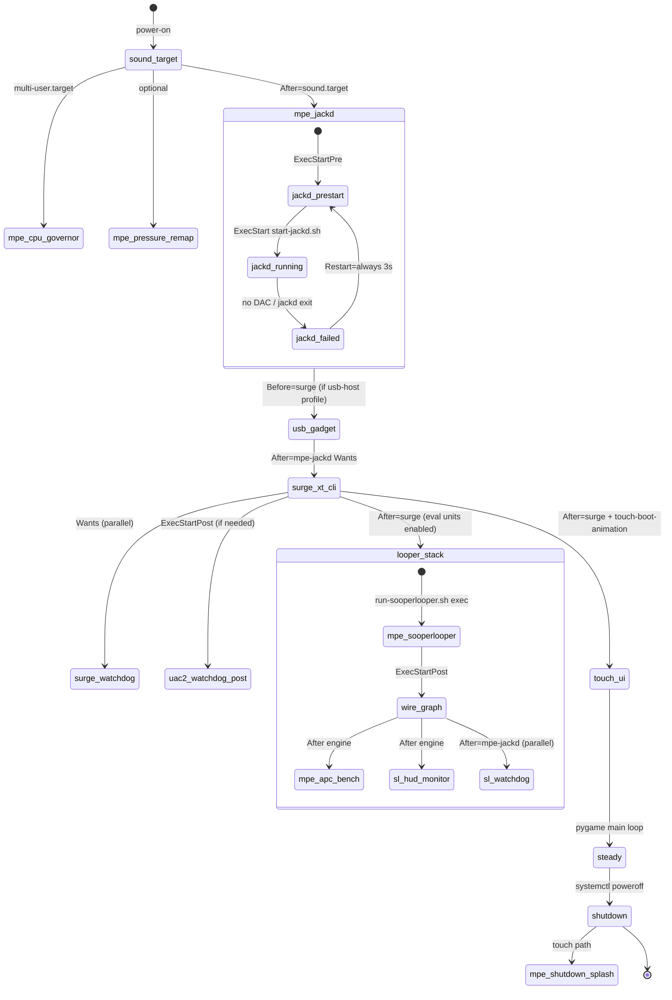
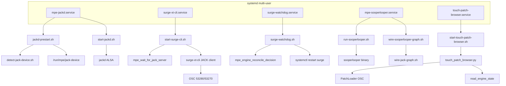
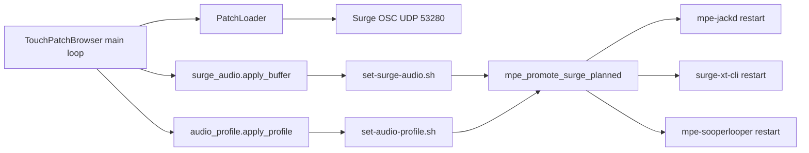
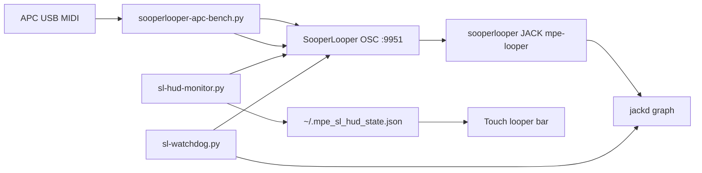

# MPE-Module — Code Map

*Last updated: 2026-08-17 (America/Toronto)*

Canonical function-level map of the Raspberry Pi MPE sound appliance: boot order, systemd units, shell/Python entrypoints, call relationships, runtime state, and test coverage.

**Orientation:** [`AGENTS.md`](../AGENTS.md) · [`docs/PATHS.md`](PATHS.md) · [`COMMANDS.md`](../COMMANDS.md) · [`Documents/DIRECTION.md`](../Documents/DIRECTION.md) · [`Documents/DECISIONS.md`](../Documents/DECISIONS.md) · [`Documents/specs/session-control-plane-spec.md`](../Documents/specs/session-control-plane-spec.md) (planned control plane — D15/D16 looper gates)

---

## 1. Executive overview

The MPE appliance is a headless **Surge XT** synthesizer on a Raspberry Pi, driven by a **touch patch browser** (pygame on DSI) or legacy OLED browser. **JACK** (`jackd2`) is the sole audio engine — Surge connects as a JACK client; there is no ALSA fallback. A **SooperLooper eval stack** (16 loops, APC mini grid) runs beside Surge on the same JACK graph when enabled via systemd. Supervisors (`surge-watchdog`, `sl-watchdog`) repair graph drift and rate-limit restarts. Runtime state lives in `/run/mpe` (tmpfs). Configuration is `/etc/mpe/mpe.env`.

### Subsystems (one-line purpose)

| # | Subsystem | Purpose |
|---|-----------|---------|
| 1 | **JACK / audio graph** | `jackd` on tier-selected DAC; shared buffer/rate; graph restarts on device change |
| 2 | **Surge / audio engine** | Headless Surge XT CLI as JACK client; OSC patch load; MIDI via pressure remapper |
| 3 | **Touch patch browser** | Fullscreen pygame UI: browse, load patches, mixer, settings, looper HUD |
| 4 | **SooperLooper (eval)** | 16-loop engine + JACK wiring + grid sync — supervised production path when units enabled |
| 5 | **APC / MIDI bench** | APC mini clip grid, faders, transport; OSC to SooperLooper |
| 6 | **Watchdogs** | Surge crash/JACK reconcile; SL graph repair, orphan detection, xrun alarms |
| 7 | **USB / UAC2 host** | USB audio gadget, host-route watcher, stall recovery (profile-dependent) |
| 8 | **MIDI clock / sync** | Boss RC-5 clock in; quantize/through to Surge (touch settings) |
| 9 | **Deploy / Pi ops** | `configure-pi-paths.sh`, unit install, DAC volume, audio profile |
| 10 | **YOLO / nerdrack** | Headless agent queue, gates, nerdrack bootstrap (dev only) |

**Inventory scale (Pass 1):** ~86 `patch_browser/*.py`, ~28 `scripts/sooperlooper/*`, ~100+ top-level `scripts/*.sh`, 23 `config/*.service`, 14 `scripts/lib/*.sh`, 96 `tests/test_*.py`.

---

## 2. Boot & lifecycle (state machine)

### 2.1 Power-on → steady state



### 2.2 Enabled systemd units (`scripts/install-units.sh`)

| Unit | After / Wants | ExecStart (repo path) | Restart |
|------|---------------|----------------------|---------|
| `mpe-jackd.service` | After `sound.target` | `scripts/jackd-prestart.sh` → `scripts/start-jackd.sh` | always |
| `surge-xt-cli.service` | After `mpe-jackd`, `usb-audio-gadget`, governors | `scripts/start-surge-cli.sh` | on-failure |
| `surge-watchdog.service` | After `surge-xt-cli` (not BindsTo) | `scripts/surge-watchdog.sh` | always |
| `mpe-sooperlooper.service` | After `mpe-jackd`, `surge-xt-cli` | `scripts/sooperlooper/run-sooperlooper.sh` + Post `wire-sooperlooper-graph.sh` | always |
| `mpe-apc-bench.service` | After `mpe-sooperlooper` | `scripts/sooperlooper-apc-bench.py` | always |
| `sl-hud-monitor.service` | After `mpe-sooperlooper` | `scripts/sooperlooper/sl-hud-monitor.py` | always |
| `sl-watchdog.service` | After `mpe-jackd` | `scripts/sooperlooper/sl-watchdog.py` | always |
| `touch-patch-browser.service` | After `surge-xt-cli`, `touch-boot-animation` | `scripts/prepare-dsi-display.sh` → `scripts/start-touch-patch-browser.sh` | on-failure |
| `surge-poly-governor.service` | — | `scripts/surge-poly-governor.py` | — |
| `mpe-cpu-governor.service` | — | `scripts/set-cpu-governor.sh` | — |
| `mpe-audio-profile-sync.service` | — | `scripts/sync-audio-profile-on-boot.sh` | — |
| `mpe-pressure-remap.service` | — | `scripts/mpe-pressure-remap.py` | — |
| `midi-clock-in.service` | After `sound.target` | `scripts/midi-clock-in.py` | on-failure |
| `mpe-shutdown-splash.service` | — | `touch_shutdown_splash.py` | — |

**Disabled by default:** `midi-clock-out`, `boot-animation`, `mic-to-uac2-bridge`. **Static:** `foot-pedal.service`. **UI mode:** `MPE_UI_MODE=touch` → touch units; `oled` → `patch-browser.service` + OLED animations.

### 2.3 Runtime state files (`/run/mpe`)

| File | Writers | Keys |
|------|---------|------|
| `engine.state` | `start-jackd.sh`, `start-surge-cli.sh`, `surge-watchdog.sh`, `audio-engine.sh` | `engine`, `active`, `state`, `reason`, `looper`, `updated` |
| `jack.state` | `start-jackd.sh` | `device`, `period`, `periods`, `rate`, `started` |
| `surge.state` | `start-surge-cli.sh` | `active`, `device`, `started` |
| `engine-reconcile.state` | `surge-watchdog.sh` | `last_restart`, `restarts` |
| `jack-device` | `jackd-prestart.sh` | `JACK_DEVICE`, `JACK_CARD_ID`, `TIER` |
| `planned-promote` | `mpe_promote_surge_planned()` | timestamp |

**Python reader:** `patch_browser/audio_engine.py` (`read_engine_state`, HUD helpers). **Touch HUD looper file:** `~/.mpe_sl_hud_state.json` (from `sl-hud-monitor.py`).

### 2.4 Engine state transitions

| `state` | Meaning | Typical `reason` |
|---------|---------|------------------|
| `ok` | Surge on JACK graph | (empty) |
| `recovering` | jackd starting, promote in flight, supervisor restart | `jackd-starting`, `promote-planned`, `promote-to-jack` |
| `failed` | No server, no JACK device, supervisor exhausted | `no-server`, `no-jack-device`, `supervisor-exhausted` |

---

## 3. Subsystem deep dives

### 3.1 JACK / audio graph

**Entry points:** `mpe-jackd.service` → `jackd-prestart.sh` + `start-jackd.sh`; udev → `restart-audio-graph.sh`; touch settings → `set-surge-audio.sh` / `set-audio-profile.sh` → `mpe_promote_surge_planned()`.

**External interfaces:** ALSA `hw:N` from detection; JACK ports via `jack_lsp`; env `MPE_JACK_BUFFER`, `MPE_JACK_PERIODS`, `MPE_JACK_SOFTMODE`.

#### Function table — `scripts/lib/audio-engine.sh`

| Function | File | Called by | Calls | Purpose |
|----------|------|-----------|-------|---------|
| `mpe_buffer_env_canonical()` | audio-engine.sh:43 | `mpe_export_synced_buffer_env`, `start-jackd.sh` | — | Valid JACK period (64–1024) |
| `mpe_jack_period()` / `mpe_jack_periods()` / `mpe_jack_rate()` | :64–86 | `start-jackd.sh`, tests | `mpe_buffer_env_canonical` | Server params |
| `mpe_jack_softmode_enabled()` | :92 | `start-jackd.sh`, `bench-xruns.sh` | — | `-s` softmode vs strict |
| `mpe_run_dir()` | :120 | all state writers | `mkdir` | `/run/mpe` or fallback |
| `mpe_state_write_atomic()` | :134 | state writers | — | Atomic KEY=value files |
| `mpe_engine_state_write()` | :192 | jackd, surge, watchdog, promote | `mpe_state_write_atomic` | Publish HUD status |
| `mpe_jack_server_ready()` | :279 | surge start, watchdog, SL launcher | `mpe_jack_lsp` | Server accepting clients |
| `mpe_wait_for_jack_server()` | :290 | `start-surge-cli.sh`, `run-sooperlooper.sh` | poll loop | Bounded readiness |
| `mpe_restart_audio_graph()` | :389 | udev, profile switch, promote | `systemctl restart mpe-jackd` | Device/buffer change |
| `mpe_promote_surge_planned()` | :449 | `set-surge-audio.sh`, touch modals | restart jackd + surge + looper | Operator graph change |
| `mpe_engine_reconcile_decision()` | :583 | `surge-watchdog.sh` | — | cooldown / settle / failed |
| `mpe_surge_on_jack_graph()` | :641 | watchdog reconcile | `jack_lsp \| grep surge` | Promotion probe |

#### Function table — JACK scripts

| Function / script | Called by | Calls | Purpose |
|-------------------|-----------|-------|---------|
| `_physical_card_present()` | `jackd-prestart.sh` | `/proc/asound/cards` | Wait for USB DAC |
| `detect-jack-device.sh` | prestart | `detect-audio-device.sh` | Tier selection → `JACK_DEVICE=` |
| `start-jackd.sh` | systemd | `audio-engine.sh`, `exec jackd` | Run server |
| `restart-audio-graph.sh` | udev rules | `mpe_restart_audio_graph`, DAC volume | Hotplug handler |

---

### 3.2 Surge / audio engine

**Entry points:** `surge-xt-cli.service` → `scripts/start-surge-cli.sh` (Type=forking, backgrounds Surge).

**External interfaces:**
- OSC in **53280**, out **53270**
- JACK client name **Surge XT**
- MIDI: **Midi Through** (index from `--list-devices`) when `MPE_PRESSURE_REMAP=1`
- Binary: `$MPE_SURGE_ROOT/build/surge-cli` (via `paths.sh`)

#### Function table — Surge startup

| Function | File | Called by | Calls | Purpose |
|----------|------|-----------|-------|---------|
| `resolve_jack_device_index()` | start-surge-cli.sh:38 | main path | `$SURGE_CLI --list-devices` | JACK device index |
| `engine_log()` | :26 | throughout | journal + log file | Dual logging |
| `mpe_wait_for_jack_server()` | :123 | startup | audio-engine.sh | Wait before Surge |
| `mpe_publish_jack_engine_failure()` | audio-engine.sh:383 | failure path | state write | `state=failed` exit 1 |
| `mpe_surge_state_write()` | :337 | success path | — | Per-Surge snapshot |

**Downstream Python (OSC patch load):** `patch_browser/patch_loader.py` — `load_patch()`, `_send_combined_volume()`, hold/normalization sidecars.

| Method | Called by | Calls | Purpose |
|--------|-----------|-------|---------|
| `PatchLoader.load_patch()` | touch mixins, tests | OSC `/load`, normalization, hold | Load .fxp |
| `set_volume()` / `_send_combined_volume()` | mixer UI | OSC `/param/.../volume` | Level + norm |
| `_apply_patch_normalization()` | load_patch | `PatchNormalizationStore` | Per-patch gain |

**Monitors (touch process threads):** `SurgeMonitor`, `SurgeCpuMonitor`, `SurgePeakMonitor` (optional JACK tap if `MPE_PEAK_METER=1`).

---

### 3.3 Touch patch browser

**Entry points:**
- systemd: `touch-patch-browser.service` → `start-touch-patch-browser.sh` → `touch_patch_browser.py` → `patch_browser.touch_browser_app.main()`
- Direct: `python3 touch_patch_browser.py`

**Key env:** `MPE_UI_MODE`, `MPE_TOUCH_WINDOWED`, `MPE_TOUCH_EVDEV`, `SDL_VIDEODRIVER=kmsdrm`, `MPE_PEAK_METER`.

#### Architecture

`TouchPatchBrowser` (MRO stack of ~15 mixins) orchestrates:
- **Patches:** `TouchBrowserPatchesMixin` → `PatchScanner`, `PatchLoader`
- **Browse/nav:** `TouchBrowserBrowseMixin`, `TouchBrowserNavMixin`
- **Settings:** audio profile, Surge buffer/rate, MIDI sync, WiFi modals
- **Draw/input:** `TouchBrowserDrawMixin`, `TouchBrowserInputMixin`, `frame_pacing.frame_rate_for()`
- **Looper HUD:** reads `sl_hud_state.read_sl_hud_state()`, `looper_hud.*`, `engine_state_monitor`

#### Function table — core app

| Function / class | File | Called by | Calls | Purpose |
|------------------|------|-----------|-------|---------|
| `TouchPatchBrowser.__init__()` | touch_browser_app.py:95 | `main()` | pygame, scanners, monitors | Build UI state |
| `main()` | :479 | `touch_patch_browser.py` | signal handlers, run loop | Entry |
| `_exit_on_signal()` | :474 | SIGINT/SIGTERM | `log_shutdown_event` | Clean exit |
| `acquire_browser_display()` | dsi_splash.py | `__init__` (fullscreen) | DRM/kmsdrm | Display handoff from boot anim |
| `frame_rate_for()` | frame_pacing.py:26 | main loop | — | Adaptive FPS |
| `read_engine_state()` | audio_engine.py:162 | draw/HUD | filesystem | `/run/mpe/engine.state` |
| `read_sl_hud_state()` | sl_hud_state.py:17 | looper bar | `~/.mpe_sl_hud_state.json` | Transport/BPM |

#### Function table — patch pipeline

| Function | File | Called by | Purpose |
|----------|------|-----------|---------|
| `PatchScanner.scan()` | patch_scanner.py | app init, refresh | Directory walk + metadata |
| `stable_key_from_absolute_path()` | patch_sidecar_key.py | sidecar stores | Identity for JSON sidecars |
| `PatchNormalizationStore.*` | patch_normalization.py | loader, settings | Gain calibration |
| `PatchPressureStore.*` | patch_pressure.py | loader, mixer | MPE floor remap |
| `apply_profile()` | audio_profile.py:96 | settings modal | `set-audio-profile.sh` subprocess |

---

### 3.4 SooperLooper (eval — supervised when units enabled)

**Marking:** Production **supervised** path on shipped appliance (units in `ENABLED` since 2026-08-17). Binary lives **outside repo** at `~/src/sooperlooper-1.7.9/...` (eval build). Adopt/kill verdict per [`Documents/DIRECTION.md`](../Documents/DIRECTION.md).

**Entry points:**
- `mpe-sooperlooper.service` → `run-sooperlooper.sh` (foreground `exec`)
- Post: `wire-sooperlooper-graph.sh` → `configure-grid-sync.sh`, `wire-jack-graph.sh connect`
- Manual: `scripts/sooperlooper/restart-sooperlooper.sh`, `mpe looper sl-restart`

**External interfaces:**
- OSC **9951** (engine), **9961** (watchdog listen), **9953** (bench listen)
- JACK client **`mpe-looper`**
- 16 loops, `-t 40` default

#### Function table — engine launcher

| Script / function | Called by | Calls | Purpose |
|-------------------|-----------|-------|---------|
| `run-sooperlooper.sh` | systemd | `mpe_wait_for_jack_server`, `exec sooperlooper` | Supervised engine |
| `wire-sooperlooper-graph.sh` | ExecStartPost | `configure-grid-sync.sh`, `wire-jack-graph.sh` | Record/play paths |
| `wire-jack-graph.sh` | wire script | `jack_connect` | Surge → loopN_in, common_out → playback |
| `restart-sooperlooper.sh` | manual, `mpe_restart_looper_after_graph_change` | kill + start + wire | Hand repair |

#### Function table — `scripts/sooperlooper/*.py`

| Function / class | File | Called by | Calls | Purpose |
|------------------|------|-----------|-------|---------|
| `SlQuery` / `HudWriter` | sl_hud_monitor.py | systemd | OSC `/get`, file write | HUD state file |
| `main()` | sl_hud_monitor.py:240 | systemd | poll loop | ~5s transport poll |
| `jack_graph()` / `jack_client_visible()` | sl-watchdog.py | main loop | `jack_lsp` | Orphan detection |
| `check_command_path()` | sl_probe.py | sl-watchdog | OSC `/hit` probe | Wedge vs orphan |
| `main()` | sl-watchdog.py:332 | systemd | repair playback, alarm | Non-destructive repair only |
| `apply_grid_sync()` | sl_grid_sync.py | apc-bench, CLI | OSC `/set` | Grid clock mode |
| `plan_gesture()` / `plan_tap()` | loop_model.py | apc_footswitch | state machine | Clip pad gestures |
| `LoopMix` / `CoalescingSender` | loop_mix.py | apc-bench | OSC wet levels | Fader law + auto-mix |
| `GridView` / `pad_note()` | apc_grid.py | apc-bench | — | 8×2 clip grid |
| `LoopFootswitch` | apc_footswitch.py | apc-bench | OSC `/hit`, `/undo_all` | Tap/hold/clear |
| `build_footswitches()` | apc_footswitch.py:392 | apc-bench main | — | 16 loop controllers |

---

### 3.5 APC / MIDI bench

**Entry point:** `mpe-apc-bench.service` → `scripts/sooperlooper-apc-bench.py`

**External:** APC mini USB MIDI; OSC to engine; `SlBenchStateListener` on UDP 9953.

| Function | File | Called by | Purpose |
|----------|------|-----------|---------|
| `main()` | sooperlooper-apc-bench.py:74 | systemd | MIDI loop + grid |
| `SlBenchStateListener.start()` | sl_bench_listener.py | main | OSC auto-update registration |
| `midi_note_down()` | sooperlooper-apc-bench.py:48 | MIDI dispatch | Note on/off |
| `resolve_fader_ccs()` | apc_faders.py | main | CC → loop index |
| `bank_delta_for_arrow()` | apc_transport.py | transport | Viewport paging |

**Related (non-bench):** `scripts/mpe-pressure-remap.py` (systemd) — LUMI pressure → Midi Through. `scripts/midi-clock-in.py` — pedal clock → `patch_browser/midi_clock.py` consumers.

---

### 3.6 Watchdogs

#### Surge watchdog (`surge-watchdog.service`)

| Function | File | Called by | Calls | Purpose |
|----------|------|-----------|-------|---------|
| `_supervisor_restart_surge()` | surge-watchdog.sh:20 | main loop | `mpe_engine_reconcile_decision`, systemctl | Rate-limited Surge restart |
| `_reconcile_engine()` | :65 | main loop | `mpe_surge_on_jack_graph` | Promote to JACK |
| main `while true` | :102 | systemd | sleep 5 | Poll forever |

**Python mirror (tests only for reconcile math):** `reconcile_cooldown_decide()` in `audio_engine.py` ↔ `mpe_engine_reconcile_decision()` in shell.

#### SooperLooper watchdog (`sl-watchdog.service`)

| Function | Purpose |
|----------|---------|
| JACK visibility first | Detect orphan after jackd restart |
| Repair `common_out` → `system:playback` | Non-destructive |
| Alarm on wedge / high xrun rate | Writes `~/.mpe_sl_watchdog.json` |
| Optional CPU governor repair | `systemctl restart mpe-cpu-governor` |

---

### 3.7 Deploy / Pi ops

**Entry points:** `configure-pi-paths.sh` (--local on Pi), `install-units.sh`, `deploy-all.sh` (human gate).

| Function | File | Called by | Purpose |
|----------|------|-----------|---------|
| `mpe_enable_core_services()` | mpe-services.sh:120 | configure-pi-paths | Enable jackd, surge, UI, looper stack |
| `mpe_patch_browser_unit()` | :11 | restart helpers | touch vs oled unit name |
| `mpe_source_appliance_env()` | :28 | service scripts | Load `/etc/mpe/mpe.env` |
| `_run_on_pi()` | configure-pi-paths.sh:26 | --local | Write mpe.env, install units |
| `mpe_apply_dac_volume()` | dac-volume.sh | boot sync, set-dac-volume | Sound Blaster Speaker control |

**External CLI (separate repo):** `mpe` from [mpe-cli](https://github.com/MitchSchwartz/mpe-cli) — `ping`, `status`, `logs`, `osc-check`, `restart`, `looper sl-*`.

---

### 3.8 YOLO / nerdrack (dev only)

**Not production boot path.** Queue: `.claude/primitives/yolo-queue.json`.

| Script | Purpose |
|--------|---------|
| `enqueue-yolo-task.sh` | Add/approve/clear-gate tasks |
| `claude-yolo.sh` | Nerdrack headless agent entry |
| `check-yolo-gates.sh` | Gate A + queue before YOLO |
| `run-yolo-queue.sh` | Drain ready tasks |
| `bootstrap-nerdrack.sh` | Remote setup |
| `mpe-yolo-remote.sh` | Pi-side remote helper |

---

## 4. Master call graphs

### 4.1 Boot / audio layer



### 4.2 UI → engine edges



### 4.3 Looper control path (eval)



---

## 5. Shared libraries (`scripts/lib/*.sh`)

| Library | Exports (functions) | Sourced by |
|---------|---------------------|------------|
| **audio-engine.sh** | 48 functions: state I/O, JACK probes, promote, reconcile, looper restart | `start-jackd.sh`, `start-surge-cli.sh`, `surge-watchdog.sh`, `run-sooperlooper.sh`, `set-surge-audio.sh`, `set-audio-profile.sh`, `restart-audio-graph.sh`, `bench-xruns.sh`, `uac2-stall-watchdog.sh`, `engine-guard.sh` |
| **mpe-services.sh** | `_mpe_ui_mode_normalized`, `mpe_patch_browser_unit`, `mpe_enable_core_services`, `mpe_restart_core_services`, env readers | `configure-pi-paths.sh`, `set-dac-volume.sh`, `sync-audio-profile-on-boot.sh`, `set-surge-audio.sh`, `bench-xruns.sh` |
| **paths.sh** | `mpe_apply_pi_home`, `mpe_pi_ssh`, repo path vars (`MPE_MODULE_REPO`, `SURGE_CLI`, `LOG_FILE`) | Nearly all scripts |
| **dac-volume.sh** | `sound_blaster_card_index`, `mpe_apply_dac_volume` | `set-dac-volume.sh`, `restart-audio-graph.sh`, boot sync |
| **engine-guard.sh** | `mpe_looper_engine_blocked`, `mpe_guard_looper_engine` | **Stale:** blocks `MPE_LOOPER_ENABLED=1` though SooperLooper works — see §8 |
| **uac2-card.sh** | `uac2_card_index`, `uac2_appl_ptr`, rate helpers | `uac2-stall-watchdog.sh` |
| **uac2-host-route.sh** | streaming mark/active/clear | stall watchdog, profile switch |
| **gadget-persist.sh** | `mpe_gadget_persist_enabled` | `mpe-services.sh` USB gadget enable |
| **profile-switch-flag.sh** | flag set/mark/clear | surge start, profile scripts (skip MIDI wait) |
| **detect-drm-card.sh** | `detect_drm_card_device` | `start-touch-patch-browser.sh` |
| **wait-for-uac2-gadget.sh** | `wait_for_uac2_gadget` | `set-audio-profile.sh`, `set-surge-audio.sh` |
| **unload-snd-aloop.sh** | (module unload) | `start-surge-cli.sh` |
| **uac2-recovery-state.sh** | recovery set/clear | stall watchdog |
| **pi-runtime.sh** | Pi SSH helpers | deploy scripts |

---

## 6. Test coverage map

| Test module | Subsystem / functions verified |
|-------------|-------------------------------|
| `test_systemd_units.py` | All `ENABLED` units exist, ExecStart paths, looper Restart=always, no ghost ConditionPathExists |
| `test_audio_engine.py` | `reconcile_cooldown_decide`, `mpe_engine_reconcile_decision` parity, state readers, promote flags |
| `test_detect_audio_device.py` | Tier detection, JACK device selection |
| `test_surge_audio.py` | Buffer/rate labels, `apply_buffer` script invocation |
| `test_audio_switch_progress.py` | `audio_switch_progress_message()` overlay text |
| `test_looper_health.py` | `JackGraphHealth`, xrun counters |
| `test_sl_watchdog*.py` | Orphan, host health, engine down paths |
| `test_apc_*` | Grid, transport, faders, footswitch, bench listener |
| `test_loop_mix.py` | Fader law, auto-mix |
| `test_sl_grid_sync.py` | Grid sync OSC sequences |
| `test_loop_model.py` | Gesture state machine |
| `test_touch_browser_*.py` | UI smoke, browse, nav, normalization, long-press |
| `test_patch_*` | Scanner, loader, normalization, pressure, hold, sidecar keys |
| `test_midi_sync.py` / `test_midi_clock.py` | Quantize grid, clock through |
| `test_calibration_*.py` | Normalization calibration pipeline |
| `test_uac2_*.py` | Gadget stall watchdog, card helpers |
| `test_mpe_yolo_remote.py` | YOLO remote script contract |
| `test_mpe_env_file.py` | Hermetic env (`MPE_ENV_FILE`) |
| `test_dac_volume.sh` | DAC dB ↔ raw mapping |

Run: `python3 -m unittest discover -s tests -q`

---

## 7. Verification log

| Pass | Date (America/Toronto) | Method | Issues found | Fixed in map? |
|------|------------------------|--------|--------------|---------------|
| **1 — Inventory** | 2026-08-17 18:34 | Glob `**/*.{py,sh}`, `config/*.service`; read AGENTS, PATHS, COMMANDS, DIRECTION | 343 py/sh total in tree (includes tests/manual); 23 systemd units; retired `mpe-looper.service` absent (expected) | Yes |
| **2 — Call tracing** | 2026-08-17 18:34 | Read ExecStart chains; grep `source lib/`; grep `^def`/`^class`; trace OSC/MIDI ports | `engine-guard.sh` text contradicts live SooperLooper stack | Documented §8 |
| **3 — Cross-check** | 2026-08-17 18:34 | `test_systemd_units.py`, PATHS.md runtime state table, install-units ENABLED list, DECISIONS/DIRECTION looper status | PATHS said buffer valid 32–2048 — PATHS already corrected to 64–1024; looper units added 2026-08-17 per tests | Yes |

---

## 8. Known gaps / TODO

| Item | Severity | Notes |
|------|----------|-------|
| **`MPE_LOOPER_ENABLED` / `engine-guard.sh`** | Product | Guard says looper impossible on JACK; SooperLooper demonstrably works. Setting `=1` may still block via stale guard paths. Needs product decision ([`engine-guard.sh`](../scripts/lib/engine-guard.sh) comment 2026-08-17). |
| **`looper=` state label** | Low | `mpe_looper_state_label()` returns `guarded` when enabled — nothing emits `enabled` yet. |
| **SooperLooper binary path** | Deploy | Not in repo; default `~/src/sooperlooper-1.7.9/...`. B8 persistence still open per DIRECTION.md. |
| **OLED patch browser** | Parallel UI | `patch-browser.service` + `patch_browser_ui.py` — less detail in this map (touch is default `MPE_UI_MODE`). |
| **Dead code suspects** | Low | `mpe_guard_looper_engine()` — no systemd consumer after `mpe-looper.service` deletion. |
| **Manual / eval scripts** | Info | `scripts/sooperlooper/smoke-16-loops.sh`, `diagnose-16loop-crackle.sh`, `scripts/manual/*` — not boot path. |
| **Function tables** | Doc | Touch mixin methods (100+ draw/hit handlers) collapsed — see `patch_browser/touch_browser_*.py` for full UI surface. |

### Human input needed

Tracked in [`session-control-plane-spec.md`](../Documents/specs/session-control-plane-spec.md) as **D15** (looper adopt/kill gate) and **D16** (`MPE_LOOPER_ENABLED` semantics):

1. Should `MPE_LOOPER_ENABLED=1` remain, and should it gate anything now that SooperLooper is supervised?
2. Is SooperLooper **adopt** or **eval-only** for the next release branch (affects whether APC bench units stay in default `ENABLED`)?

---

## Appendix A — Code citation anchors

Boot chain entry:

```37:51:scripts/start-jackd.sh
echo "Starting jackd on $HW_DEV — ${JACK_BUFFER} x ${JACK_PERIODS} @ ${JACK_RATE} Hz (${SOFTMODE_LABEL})"
mpe_jack_state_write "$HW_DEV" "$JACK_BUFFER" "$JACK_PERIODS" "$JACK_RATE"
# ...
exec jackd -R -P"$JACK_PRIO" "${SOFTMODE_ARGS[@]}" \
    -d alsa -P "$HW_DEV" -r "$JACK_RATE" -p "$JACK_BUFFER" -n "$JACK_PERIODS"
```

Surge hard-fail (no ALSA fallback):

```147:153:scripts/start-surge-cli.sh
if [ -z "$ACTIVE_ENGINE" ]; then
    ENGINE_STATE=failed
    engine_log "CRITICAL: engine=jack state=failed reason=$ENGINE_REASON — no graph server available."
    mpe_publish_jack_engine_failure "$ENGINE_REASON"
    exit 1
fi
```

Touch browser entry:

```9:14:touch_patch_browser.py
from patch_browser.touch_browser_app import TouchPatchBrowser, main
# ...
if __name__ == "__main__":
    main()
```

Supervised looper (no backgrounding):

```40:42:scripts/sooperlooper/run-sooperlooper.sh
exec "$SOOP_BIN" -q -D yes -l "$LOOPS" -c 2 -t "$TIME_MAX" \
    -p "$OSC_PORT" -j "$JACK_CLIENT"
```

---

## Appendix B — Approximate function counts mapped

| Area | Classes + functions documented |
|------|--------------------------------|
| `scripts/lib/audio-engine.sh` | 48 shell functions (full table) |
| JACK/Surge shell entrypoints | 12 key functions |
| `patch_browser/audio_engine.py` | 11 public functions |
| `patch_loader.py` | 10 methods |
| SooperLooper Python (`scripts/sooperlooper/`) | ~45 classes/functions (core paths) |
| APC bench | ~15 functions |
| Watchdogs | ~10 functions |
| `mpe-services.sh` + deploy | 10 functions |
| Touch browser (core + pipeline) | ~25 named entrypoints (mixins collapsed) |
| **Total named in this map** | **~180** |
| **Repo total (`^def`/`^class`)** | **~550+** (incl. tests, calibration, UI draw helpers) |

**Subsystem count:** 10 (see §1 table).
