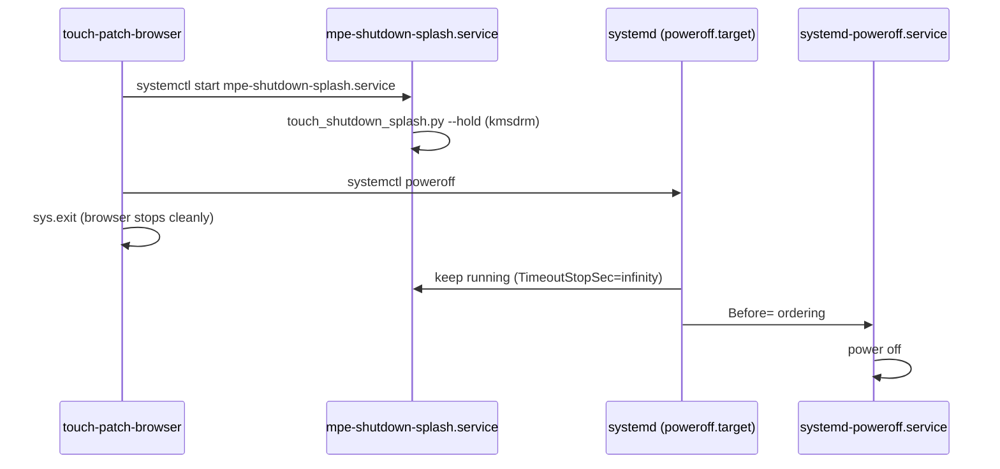

# Shutdown splash (touch DSI)

*Last updated: 2026-07-31 (America/Toronto)*

Touch-panel shutdown follows the **Plymouth pattern**: a dedicated systemd unit paints the splash **before** `systemd-poweroff.service` runs, not an in-process pygame hold inside `touch-patch-browser`.

## Why not in-app hold?

Earlier fixes (e.g. bec0cf2) ignored SIGTERM in a browser-side loop so the GUI would not return when `touch-patch-browser` was stopped during poweroff. That was a workaround. When the hold loop exited for any reason, the patch browser main loop came back — the failure mode we are eliminating.

External references consulted:

| Source | URL |
|--------|-----|
| systemd poweroff unit | https://www.freedesktop.org/software/systemd/man/latest/systemd-poweroff.service.html |
| Plymouth poweroff unit | https://gitlab.freedesktop.org/plymouth/plymouth/-/raw/main/systemd-units/plymouth-poweroff.service.in |
| Pi kiosk splash (systemd + fbi) | https://raspberrypi.stackexchange.com/questions/100371/raspbian-buster-lite-splash-screen-instead-of-boot-messages-on-pi-3-model-b-a02 |

Plymouth is **not** installed on the Pi image. We use the same **ordering principles** with our own unit and `touch_shutdown_splash.py --hold`.

## Architecture



### Unit: `mpe-shutdown-splash.service`

Mirrors Plymouth's `plymouth-poweroff.service.in`:

- `DefaultDependencies=no`
- `Before=systemd-poweroff.service systemd-reboot.service systemd-halt.service`
- **No** `Conflicts=shutdown.target` (Plymouth does not use it)
- `TimeoutStopSec=infinity` — splash stays until power is cut
- `WantedBy=halt.target reboot.target shutdown.target` — also starts on non-UI halt/reboot

User services (`touch-patch-browser`, `surge-xt-cli`, `usb-audio-gadget`) keep **bounded** `TimeoutStopSec` so a stuck daemon cannot block poweroff for minutes.

### UI path (`trigger_user_shutdown`)

Power menu confirm in `patch_browser/touch_browser_input.py`:

1. `release_display_for_shutdown()` — paint shutdown frame, `pygame.quit()` (release DRM)
2. `systemctl start mpe-shutdown-splash.service` — splash on panel immediately (no ~12s DRM retry)
3. `systemctl poweroff` or `systemctl reboot`
4. Browser exits (`sys.exit`) — **no** in-process hold loop

`trigger_user_shutdown` also stops `touch-boot-animation.service` if it is still active so boot splash cannot block shutdown splash or poweroff.

Implementation: `patch_browser/dsi_splash.py` (`release_display_for_shutdown`, `trigger_user_shutdown`).

## Diagnosis after a test shutdown

On the next boot:

```bash
./scripts/shutdown-analyze-last.sh
```

Check `/tmp/mpe-shutdown-splash.log` and journal stop lines. The splash unit should **not** show `Stopped` long before power is cut.

## Install / refresh

```bash
sudo ./scripts/configure-pi-paths.sh --local --force
sudo systemctl daemon-reload
```

Touch mode enables `mpe-shutdown-splash.service` via `scripts/lib/mpe-services.sh`.

## Migration from `touch-shutdown-animation.service`

Older touch images enabled `touch-shutdown-animation.service` (in-browser / legacy unit). That unit is **not** shipped in `config/` anymore. `configure-pi-paths.sh` disables it, removes a stale `/etc/systemd/system/touch-shutdown-animation.service` if present, and enables `mpe-shutdown-splash.service` in touch mode.

